Getting started with Grafana
============================

Grafana is an open-source dashboarding tool which binds to a broad
choice of different datasources in order to create informative data
visualization. This is a short guide how to install Grafana locally on
your PC and start working with it on one's localhost.

### Install Docker

#### Linux

First of all, using terminal, update all the packages to make sure that
everything will work properly:

`$ sudo apt-get update`

Then use this command to install Docker:

`$ sudo apt install docker.io`

*Done!*

#### Windows/MacOS

To install Docker for these OS, you may find Desktop installers on the
following links:

**Windows**:
http://hub.docker.com/editions/community/docker-ce-desktop-windows

**MacOS**:
http://hub.docker.com/editions/community/docker-ce-desktop-mac

Everything you need to do is to download installer and then follow its
instructions.

*Done!*

### Install Grafana from Docker image on your localhost

*Note*: **Don't forget to use** `sudo` **if you work on Linux!**

To install the latest image of Grafana on your PC, use the following
command in your terminal/console:

`$ docker pull grafana/grafana:latest`

When the download finishes, you may check the list of Docker images to
make sure Grafana installed successfully:

`$ docker images`

Finally, to create a Grafana container, run the following command:

`$ docker run -d --name=grafana -p 3000:3000 grafana/grafana`

Now the Grafana server container should be up. To check that it is
properly listening on the port 3000, use this command **(LINUX ONLY!)**:

`$ netstat -tulpn | grep 3000`

*Done!*

### Creating test dashboard using data from TestData DB

Open your browser and head over http://localhost:3000. You should be
redirected to the Grafana homepage:

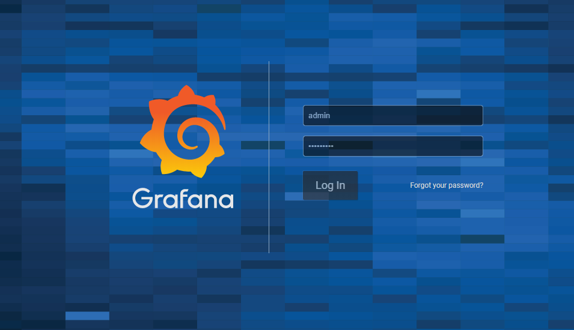

Default credentials are **admin/admin**. After you logged in, Grafana
immediately asks you to change the password, so choose the strong one
and click the **"Save"** button.

Now you should be redirected to **Grafana Web UI**.

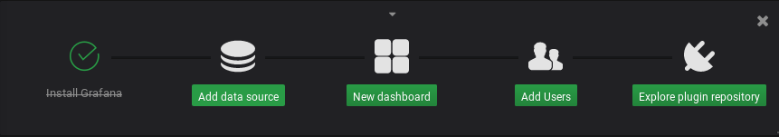

Click on **"Add data source"**, then scroll to the end of the page and
choose **TestData DB**.

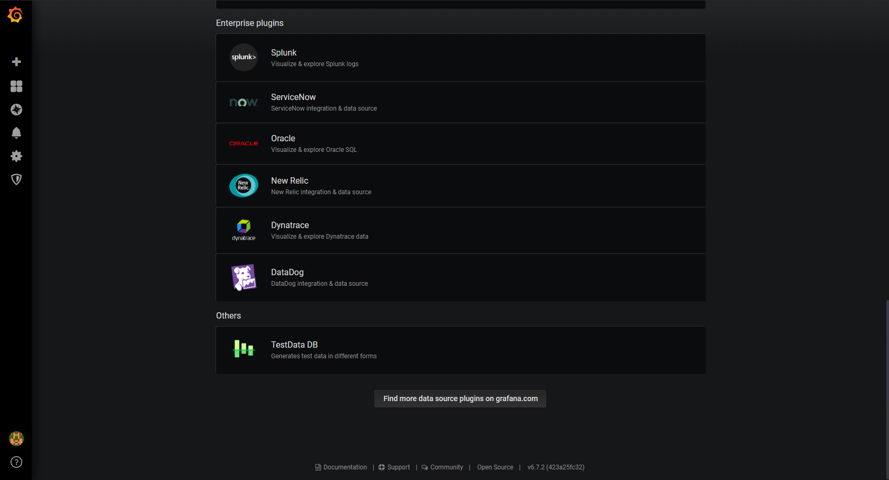

On the opened page enter the name of your DB (in my case, it is
**"TestData DB-1"**), then click on **"Save & Test"**.

You will get the message that your chosen data source is working.

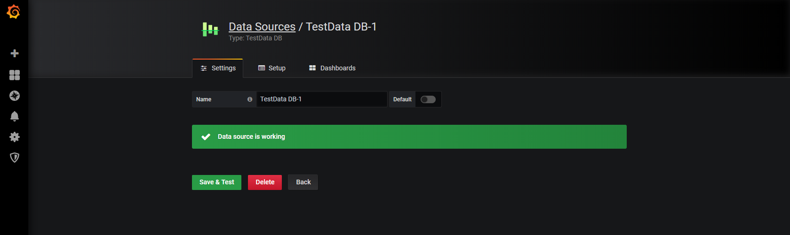

Now you need to get to the homepage to continue. You can do that by
clicking on the Grafana logo in the top left corner of the screen.

On the homepage, click on the **"New Dashboard"**.

You should be redirected to the page where you can create different
panels with data. Click on **"Add query"**.

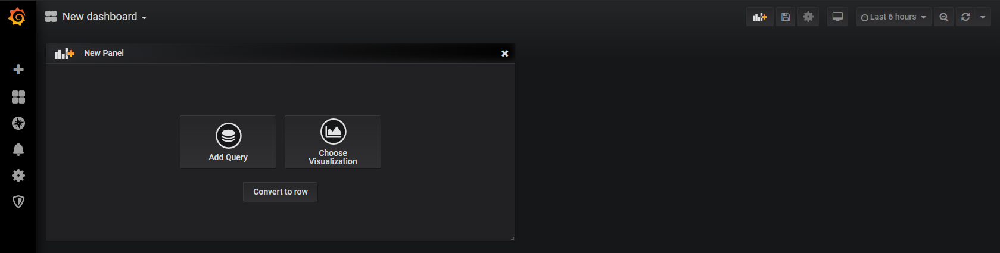

Then you get to the panel menu, where you can add a query (*here
highlighted in orange*), visualization and settings.

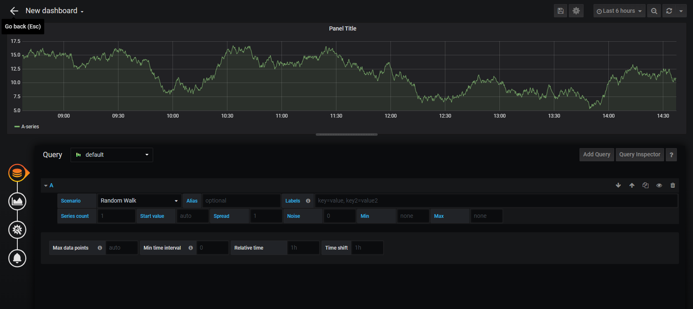

Now you need to choose to the which database you want to create a query
and choose its scenario. In the dropdown, choose your database.

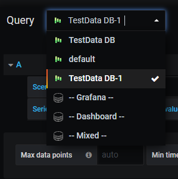

Also you may choose a scenario. Since it's test data, let's focus on the
default called **"Random walk"**. If you want, later you can train
yourself creating panels with different scenarios.

Scenario is chosen. Now we need to choose the visualization. On the left
side of the screen there is a sidebar. Click on the second from the top
icon and you will get to the visualization menu:

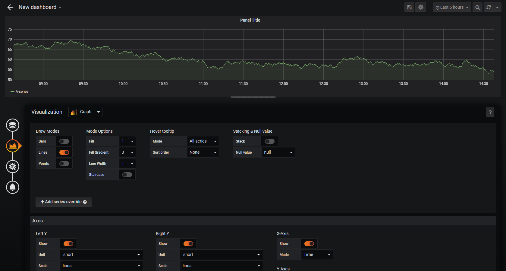

Now we have the default type of visualization -- it is **Graph**.
Clicking on the dropdown menu near the title, you are offered a wide
variety of options:

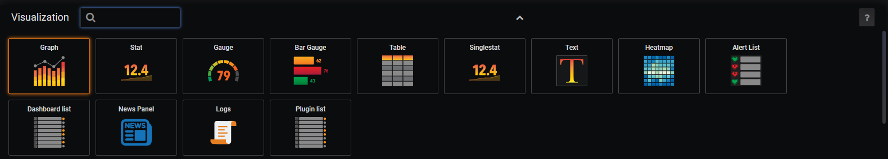

Let's check, how our scenario will look like, if we choose type
**"Stat"**, for example:

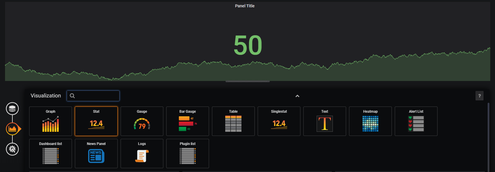

Fine. Now we need to rename our panel. To do this, choose the third from
the top icon on the sidebar and you will get to the settings menu.

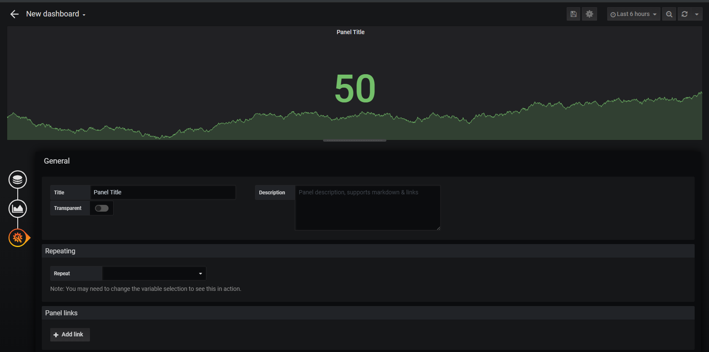

Our scenario is called **"Random walk"**, so let's name our panel the
same way.

Our panel is ready. Now we need only to save it. On the top of the
screen there is an icon of floppy disk. Clicking on it, you get to the
save menu. Confirming made changes and clicking the button **"Save"**,
you get back to your dashboard.

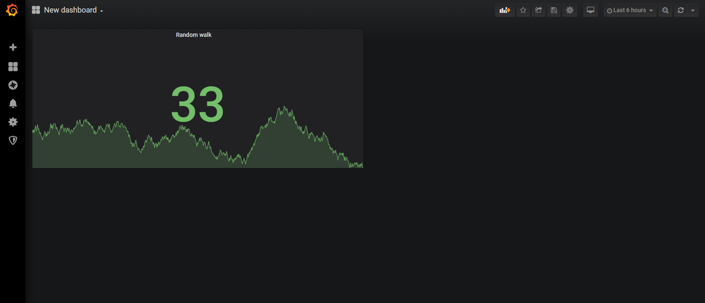

Clicking on the same icon of floppy disk on this page (it is also placed
on the top of the screen), you save your dashboard.

### Congratulations! 

You've just made your first dashboard in Grafana. Hope this guide was useful for you.
